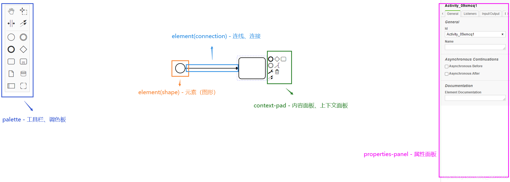

## bpmn-js 的使用文档

[TOC]

#### 介绍

- [bpmn-js](https://bpmn.io/toolkit/bpmn-js/) 是一个 BPMN 2.0 渲染工具包和 Web 建模器。它用 JavaScript 编写，将 BPMN 2.0 图表嵌入到现代浏览器中，并且不需要服务器后台。这使得它很容易嵌入到任何网络应用中。
- 既是一个查看器，也可以是一个 Web 建模器。使用查看器 `viewer` 将 BPMN 2.0 嵌入到您的应用程序中，并用您的数据丰富它。使用建模器 `modeler` 在应用程序内部创建 BPMN 2.0 图表。
- 外观：(左侧：工具栏、调色板，中间：画板，右侧：属性面板)
  - 
- 体系结构：（`diagram-js` 和 `bpmn-moddle`）
  - 绘制图形和连线（图表交互/建模）：[diagram-js](https://github.com/bpmn-io/diagram-js)
  - 读写 BPMN 2.0 架构兼容的 XML 文档 + 提供 [BPMN 2.0](https://www.omg.org/spec/BPMN/2.0/) 标准中定义的 BPMN 2.0 元模型：[bpmn-moddle](https://github.com/bpmn-io/bpmn-moddle)
  - 
- 常用库：[Viewer](https://github.com/bpmn-io/bpmn-js/blob/master/lib/Viewer.js)、[NavigatedViewer](https://github.com/bpmn-io/bpmn-js/blob/master/lib/NavigatedViewer.js)、[Modeler](https://github.com/bpmn-io/bpmn-js/blob/master/lib/Modeler.js) 
  - [Viewer](https://github.com/bpmn-io/bpmn-js/blob/master/lib/Viewer.js) BPMN 图表查看器
  - [NavigatedViewer](https://github.com/bpmn-io/bpmn-js/blob/master/lib/NavigatedViewer.js) 包含鼠标导航工具的图表查看器（用于导航画布）
  - [Modeler](https://github.com/bpmn-io/bpmn-js/blob/master/lib/Modeler.js) BPMN 图表建模器（用于创建、编辑画布上的元素并与之交互）


#### 内容

##### 库的使用

1. script 引入

   1. ```html
      <!-- 引入 css -->
      <link rel="stylesheet" href="https://unpkg.com/bpmn-js@10.2.0/dist/assets/diagram-js.css" />
      <link rel="stylesheet" href="https://unpkg.com/bpmn-js@10.2.0/dist/assets/bpmn-js.css" />
      <link rel="stylesheet" href="https://unpkg.com/bpmn-js@10.2.0/dist/assets/bpmn-font/css/bpmn.css" />
      
      <!-- BPMN 流程图的容器元素 -->
      <div id="canvas"></div>
      
      <!-- 引入 js -->
      <script src="https://unpkg.com/bpmn-js/dist/bpmn-viewer.development.js"></script>
      ```

   2. ```js
      <script>
        // XML 文档
        const bpmnXML;
      
        // BPMN 查看器
        const viewer = new BpmnJS({ container: '#canvas' });
      
        // 导入流程图
        try {
          await viewer.importXML(bpmnXML);
      	// 导入成功...
           viewer.get('canvas').zoom('fit-viewport');
        } catch (err) {
          // 导入失败...
          console.error('导入失败:', err);
        }
      </script>
      ```

      

2. npm 引入（推荐，扩展性强，更利于自定义 bpmn）

   1. ```js
      npm install bpmn-js
      ```

   2. ```html
      <!-- BPMN 流程图的容器元素 -->
      <div id="canvas"></div>
      ```

   3. ```js
      import Modeler from 'bpmn-js/lib/Modeler';
      
      // 创建一个建模器
      const modeler = new Modeler({ container: '#canvas' });
      
      // 导入流程图
      try {
        await modeler.importXML(bpmnXML);
        // 导入成功...
      } catch (err) {
        // 导入失败...
        console.error('导入失败:', err);
      }
      ```

   4. ```css
      /** bpmn-js.css */
      @import 'bpmn-js/dist/assets/bpmn-js.css';
      /** 左边工具栏以及编辑节点的样式 */
      @import 'bpmn-js/dist/assets/diagram-js.css';
      @import 'bpmn-js/dist/assets/bpmn-font/css/bpmn.css';
      @import 'bpmn-js/dist/assets/bpmn-font/css/bpmn-codes.css';
      @import 'bpmn-js/dist/assets/bpmn-font/css/bpmn-embedded.css';
      /** 右边属性面板的样式 */
      @import "bpmn-js-properties-panel/dist/assets/properties-panel.css";
      @import "bpmn-js-properties-panel/dist/assets/element-templates.css";
      /** 小地图的样式 */
      @import "diagram-js-minimap/assets/diagram-js-minimap.css";
      ```


##### 生命周期事件

```js
modeler.on('commandStack.changed', () => {
  // 用户建立了一些模型，或者进行了撤销/重做操作
});

modeler.on('element.changed', (event) => {
  const element = event.element;
  // 该元素被用户改变
});
```


##### 扩展查看器和建模器（自定义模块）

在创建时使用 `additionalModules` 选项来扩展查看器和建模器。这允许你传递修改或替换现有功能的自定义模块。

小地图（鹰眼）[diagram-js-minimap](https://github.com/bpmn-io/diagram-js-minimap)

原点十字准线 [diagram-js-origin](https://github.com/bpmn-io/diagram-js-origin)

右侧属性面板 [bpmn-js-properties-panel](https://github.com/bpmn-io/bpmn-js-properties-panel#bpmn-js-properties-panel)

[activiti-bpmn-moddle](https://github.com/igdianov/activiti-bpmn-moddle#activiti-bpmn-moddle)

[camunda-bpmn-moddle](https://github.com/camunda/camunda-bpmn-moddle#camunda-bpmn-moddle)

```js
/** 通用的用户界面附加功能 */
// 用于 diagram-js 的原点十字准线
import OriginModule from 'diagram-js-origin';
// 为 diagram-js 提供的小地图（鹰眼）
import MinimapModule from 'diagram-js-minimap';

// camunda 官方侧边栏扩展 - 右侧的属性面板
import {
  BpmnPropertiesPanelModule,
  BpmnPropertiesProviderModule,
} from "bpmn-js-properties-panel";

// 创建一个建模器
const modeler = new Modeler({
  container: '#canvas',
  // 添加 右侧的属性面板
  propertiesPanel: {
    parent: "#properties",
  },
  // 添加自定义规则
  additionalModules: [
    OriginModule,
    MinimapModule,
    BpmnPropertiesPanelModule,
    BpmnPropertiesProviderModule,
    require('./custom-rules'),
    require('./custom-context-pad')
  ]
});
```

扩展的其他例子有：

- [Adding custom elements](https://github.com/bpmn-io/bpmn-js-examples/tree/master/custom-elements)
- [Custom palette / context pad](https://github.com/bpmn-io/bpmn-js-nyan)
- [Custom shape rendering](https://github.com/bpmn-io/bpmn-js-nyan)


#### 汉化

[资源文件](https://github.com/bpmn-io/bpmn-js-i18n/blob/master/translations/zn.js)


#### 版本控制

```
npm install bpmn-js@9.4.1
npm install bpmn-js-properties-panel@1.5.0
npm install @bpmn-io/properties-panel@0.20.3
npm install diagram-js-minimap@2.1.1
npm install diagram-js-origin@1.3.4
```


#### 思维导图

[下载](./流程图bpmn-js.xmind)


#### 相关链接

[基于 `bpmn.js`，`Vue 2.x` 和 `ElementUI` 开发的 BPMN 2.0 流程设计器： bpmn-process-designer](https://github.com/miyuesc/bpmn-process-designer#bpmn-process-designer)

[线上实例：Online Demo](https://demo.bpmn.io/) 

[下载 Camunda Modeler](https://bpmn.io/modeler/)